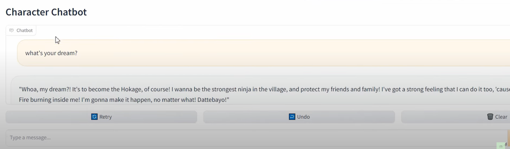
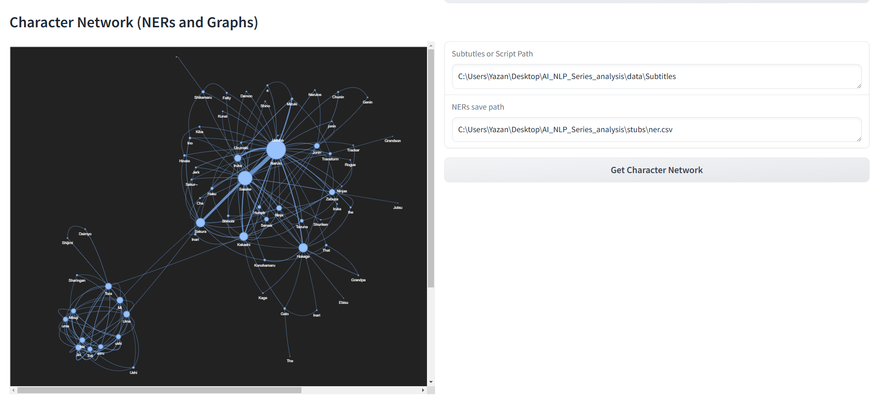
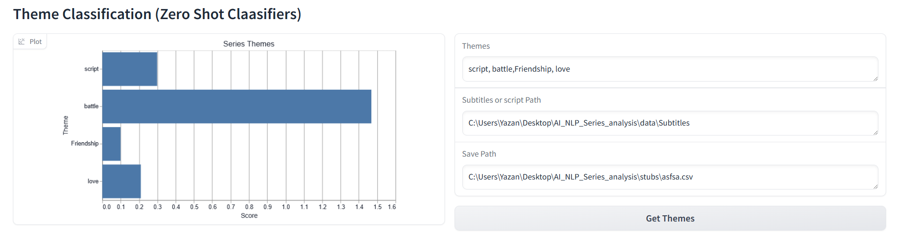

# AI_NLP_Series_Analysis_Application

This project demonstrates how advanced NLP techniques and LLMs can be used to analyze and interact with a popular series. By combining dataset collection, machine learning, and interactive tools, it creates an engaging way to explore a series like never before. 

---

## Project Overview

The project is divided into five main components:

1. **Dataset Collection and Web Scraping**
   - **Goal:** Collect datasets from the web, including subtitles, transcripts, and fight classifications from the Naruto series.
   - **Tools Used:** Scrapy crawlers for efficient and scalable web scraping.
   - **Outcome:** Cleaned and structured datasets ready for analysis.

2. **Character Chatbot**
   - **Goal:** Simulate conversations with Naruto using a fine-tuned Llama LLM (8B).
   - **Tools Used:** Llama LLM, Hugging Face Transformers (trained with mized precision and LoRA).
   - **Outcome:** An interactive chatbot providing an immersive character interaction experience.

3. **Character Network Visualization**
   - **Goal:** Visualize character interactions and communication strength.
   - **Tools Used:** SpaCy NER, NetworkX, PyViz.
   - **Outcome:** A graph network revealing interaction patterns among characters.

4. **Theme and Text Classifiers**
   - **Theme Classifier:** Users input themes like "love" or "friendship" to visualize their prevalence in the series.
   - **Text Classifier:** Classify fight scenes based on provided descriptions.
   - **Tools Used:** Hugging Face Zero-Shot Classifier, Custom LLM Text Classifier.
   - **Outcome:** Bar plots of theme prevalence and fight scene classifications.

5. **Interactive Web GUI**
   - **Goal:** Provide users an intuitive interface to access all features.
   - **Tools Used:** Gradio.
   - **Outcome:** A seamless user experience to explore the project.

## Contributing

Feel free to contribute by submitting pull requests or issues to improve the project.
